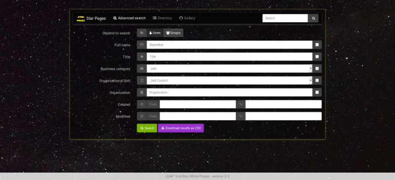
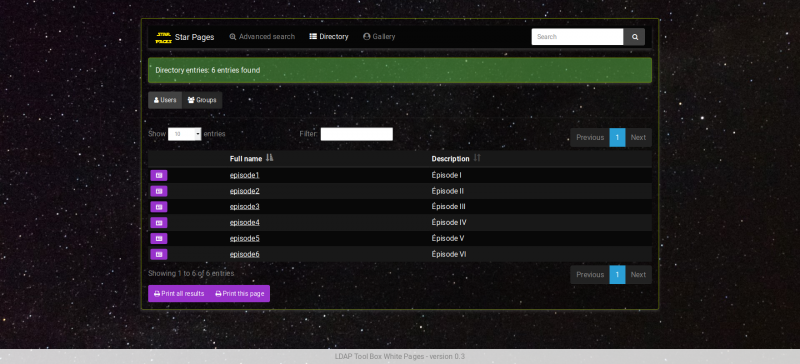
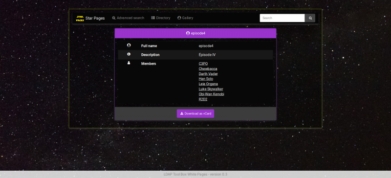

Presentation
============

White Pages is a PHP application that allows users to search and display data stored in an LDAP directory.

The application can be used on standard LDAPv3 directories and Active Directory, as all searched attributes can be set in configuration.

It has the following features:

* Quick search: a simple input in menu bar searching on some classic attributes
* Advanced search: a full form to search on several attributes
* Directory : display of all entries in a table form
* Gallery: display of all entries with their photo
* Search and display groups and members
* Export results as CSV
* Export entry as vCard

Demonstration
-------------

Check `Star Pages <http://ltb-project.org/star-pages/>`_, an online demonstration of LDAP Tool Box White Pages.

Screenshots
-----------

